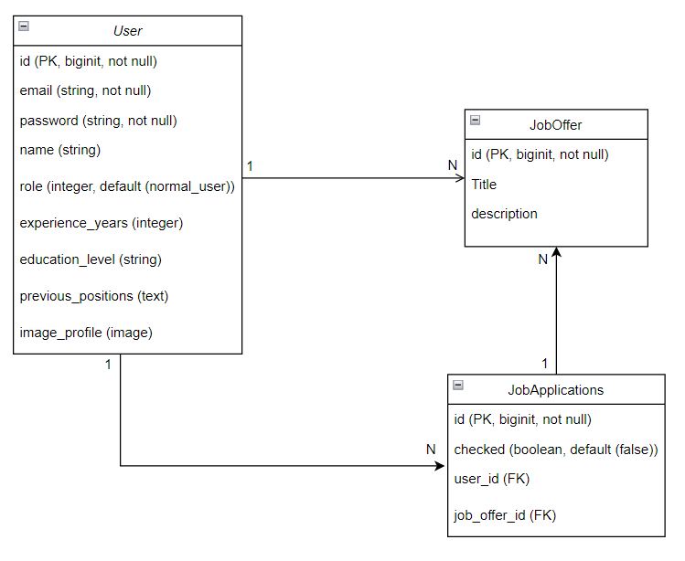
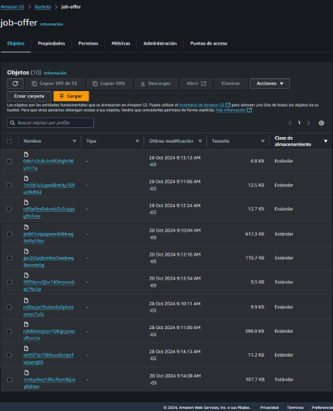

# DESARROLLO RUBY ON RAILS PARA EMPRENDIMIENTOS DE TIPO STARTUP

Prueba - Desarrollo de aplicaciones con Ruby on
Rails

## Autor

- [@Carlos-Cardenas-Bravo](https://github.com/Carlos-Cardenas-Bravo)

## Lógica utilizada

Se generó una app según lo indicado del tipo Ofertas de trabajos y aplicación a estas.

Se generaron roles dentro de los usuarios manejados con devise, de forma que el administrador fuera el único que puediera subir ofertas laborales y el único de registrar a los usuarios (sus trabajadores). este registro es básico (nombre, mail, password y rol) de forma que después el usuario normal pueda ingresar y actualizar sus datos con foto de profile, datos referentes a su trabajo para que puedan evaluar su postulación. El Administrador puede listar las ofertas, los usuarios, ver en estos las postulaciones mas recientes y las antiguas junto con el perfil actualizado de cada trabajador.

Los usuarios normales (registrados) tienen acceso ver todas las ofertas publicadasa, actualizar su perfil, postular y a ver todas su postulaciones realizadas.

Las personas entran a una página inicial sin navbar ni instrucciones solo el link de ingreso a la página.

Las claves de base de datos y Mailtrap (con el cual se probó la restitución de contraseña) se manejan con Figaro.

Se utilizó Active Storage y S3 para guardar las imagenes (las claves del bucket y usuario quedaron resaguardadas por Figaro). Y se utilizó la gema ImageProcessing para conservar la relación ancho, alto de las fotografías paro adecuarlas al formato deseado.

Se documentaron los modelos con la gema annotate.

Como se resguardan las claves por medio de Figaro para probar la aplicación debes clonar el repositorio desde GitHub, crear el archivo config/application.yml en tu máquina local, configurar tus propias claves de base de datos y S3 en ese archivo.Luego correr los comandos para preparar la base de datos y ejecutar el seed, el cual se dejó listo para ejecutar. Esta vez no se uso faker para crear un ambiente mas realista con los datos.

Se ocupó el framework de css Bulma para darle estilo a la aplicación.

## Capturas

Diagrama Relacional de la App

Carga en S3

## Versiones Utilizadas

Para tener una funcionalidad completa de la aplicación debes tener las siguientes versiones de los softwares utilizados.

`Ruby 3.3.3`

`Rails 7.2.1 `

## 🚀 About Me
I'm a human apprentice
